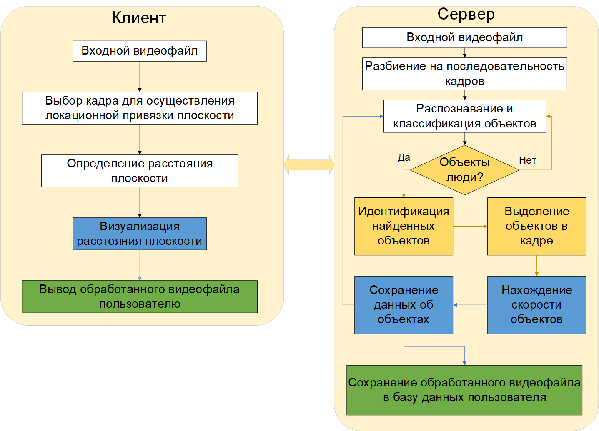

# Определение скорости объекта в видеопотоке

## Для запуска проекта необходим docker, docker-compose и стабильный доступ в интернет

### Архитектура программного средства



### Для запуска проекта выполните следующие команды
```
- git clone https://github.com/xxxFilosoFxxx/Web_speed_determination
- cd Web_speed_determination
- sudo docker-compose up -d --build
```

После сборки и развертывания откройте ссылку в браузере

```
localhost:8888
```


